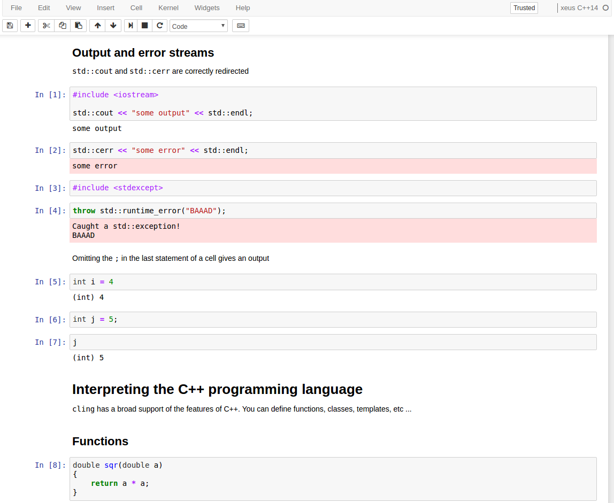
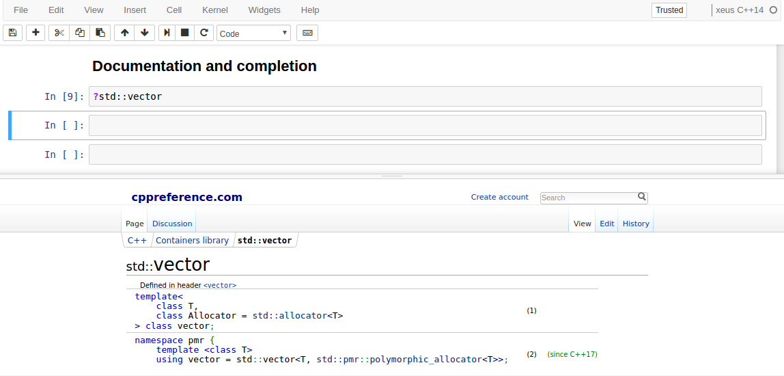
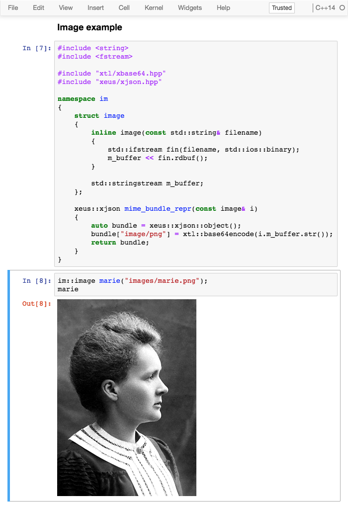
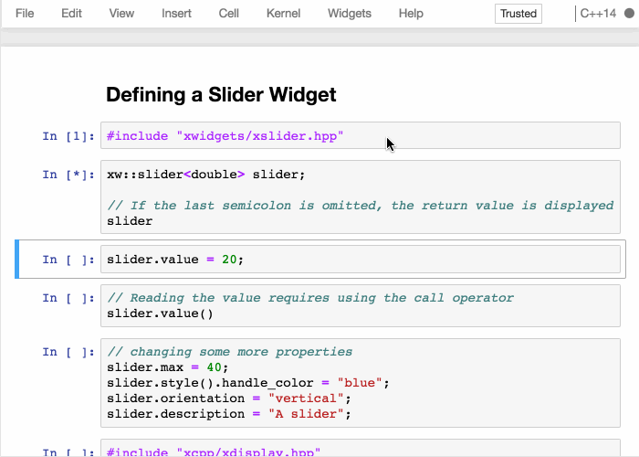

# 

[](https://travis-ci.org/jupyter-xeus/xeus-cling)
[](https://ci.appveyor.com/project/jupyter-xeus/xeus-cling)
[](https://xeus-cling.readthedocs.io/en/latest/?badge=latest)
[](https://mybinder.org/v2/gh/jupyter-xeus/xeus-cling/stable?filepath=notebooks/xcpp.ipynb)
[](https://gitter.im/QuantStack/Lobby?utm_source=badge&utm_medium=badge&utm_campaign=pr-badge&utm_content=badge)

`xeus-cling` is a Jupyter kernel for C++ based on the C++ interpreter [cling](https://github.com/root-project/cling) and
the native implementation of the Jupyter protocol [xeus](https://github.com/jupyter-xeus/xeus).

## Installation

xeus-cling has been packaged for the conda package manager on the **Linux** and **OS X** platforms. At the moment, we are not providing packages for the **Windows** platform.

To ensure that the installation works, it is preferable to install `xeus-cling` in a fresh conda environment. It is also needed to use a [miniconda](https://conda.io/miniconda.html) installation because with the full [anaconda](https://www.anaconda.com/) you may have a conflict with the `ZeroMQ` library which is already installed in the anaconda distribution.


### Installation from conda

The safest usage is to create an environment named `cling` with your miniconda installation:

```
conda create -n cling
conda activate cling  # Or `source activate cling` for conda < 4.6
```

Then you can install in this environment `xeus-cling` and its dependencies

```
conda install xeus-cling -c conda-forge
```

### Installation from source

You will first need to create a new environment and install the dependencies:

```bash
conda create -n xeus-cling -c conda-forge cmake xeus=0.23.3 cling=0.6.0 clangdev=5.0 llvmdev=5 nlohmann_json cppzmq=4.3.0 xtl=0.6.9 pugixml cxxopts=2.1.1
conda activate xeus-cling
```

You can then compile the sources:

```bash
cmake -D CMAKE_INSTALL_PREFIX=${CONDA_PREFIX} -D CMAKE_C_COMPILER=$CC -D CMAKE_CXX_COMPILER=$CXX -D CMAKE_INSTALL_LIBDIR=${CONDA_PREFIX}/lib -D DOWNLOAD_GTEST=ON
make && make install
```

If you don't have a frontend already installed (classic Jupyter Notebook or JupyterLab for instance), install one:

```bash
conda install notebook -c conda-forge
```

## Trying it online

To try out xeus-cling interactively in your web browser, just click on the binder
link:

[](https://mybinder.org/v2/gh/jupyter-xeus/xeus-cling/stable?filepath=notebooks/xcpp.ipynb)

## Documentation

To get started with using `xeus-cling`, check out the full documentation

http://xeus-cling.readthedocs.io/

## Usage

Launch the jupyter notebook with `jupyter notebook` and launch a new C++ notebook by selecting the **C++14** kernel in the *new* dropdown.

### A C++ notebook

You can now make use of the C++ programming language in the Jupyter notebook.



### Inline help and tab-completion

Quick help is shown on the pager with the special `?` magic.



Content for the quick help is available for the standard library, and can be made available for third-party packages.

### Rendering of rich outputs



### Jupyter interactive widgets

A C++ backend for the Jupyter interactive widgets is available in the [`xwidgets`](https://github.com/QuantStack/xwidgets/) package.



## Dependencies

``xeus-cling`` depends on

 - [xeus](https://github.com/jupyter-xeus/xeus)
 - [xtl](https://github.com/xtensor-stack/xtl)
 - [cling](https://github.com/root-project/cling)
 - [pugixml](https://github.com/zeux/pugixml)
 - [cxxopts](https://github.com/jarro2783/cxxopts)
 - [nlohmann_json](https://github.com/nlohmann/json)


| `xeus-cling` |   `xeus`        |      `xtl`      |     `cling`   |   `pugixml`   | `cppzmq` | `cxxopts`     | `nlohmann_json` | `dirent` (windows only) |
|--------------|-----------------|-----------------|---------------|---------------|----------|---------------|-----------------|-------------------------|
|  master      |  >=0.24.0,<0.25 |  >=0.6.5,<0.7   | >=0.6,<0.7    | ~1.8.1        | ~4.3.0   | >=2.1.1,<=3.0 | >=3.6.1,<4.0    | >=2.3.2,<3              |
|  0.9.0       |  >=0.24.0,<0.25 |  >=0.6.5,<0.7   | >=0.6,<0.7    | ~1.8.1        | ~4.3.0   | >=2.1.1,<=3.0 | >=3.6.1,<4.0    | >=2.3.2,<3              |
|  0.8.1       |  >=0.23.2,<0.24 |  >=0.6.5,<0.7   | >=0.6,<0.7    | ~1.8.1        | ~4.3.0   | >=2.1.1,<=3.0 | >=3.6.1,<4.0    | >=2.3.2,<3              |
|  0.8.0       |  >=0.23.2,<0.24 |  >=0.6.5,<0.7   | >=0.6,<0.7    | ~1.8.1        | ~4.3.0   | >=2.1.1,<=3.0 | >=3.6.1,<4.0    | >=2.3.2,<3              |
|  0.7.1       |  >=0.21.1,<0.22 |  >=0.6.5,<0.7   | >=0.5,<0.6    | ~1.8.1        | ~4.3.0   | >=2.1.1,<=3.0 | >=3.6.1,<4.0    | >=2.3.2,<3              |
|  0.7.0       |  >=0.21.1,<0.22 |  >=0.6.5,<0.7   | >=0.5,<0.6    | ~1.8.1        | ~4.3.0   | >=2.1.1,<=3.0 | >=3.6.1,<4.0    | >=2.3.2,<3              |
|  0.6.0       |  >=0.20.0,<0.21 |  >=0.6.1,<0.7   | >=0.5,<0.6    | ~1.8.1        | ~4.3.0   | >=2.1.1,<=3.0 | >=3.3.0,<4.0    | >=2.3.2,<3              |
|  0.5.1       |  >=0.19.1,<0.20 |  >=0.6.1,<0.7   | >=0.5,<0.6    | ~1.8.1        | ~4.3.0   | >=2.1.1,<=3.0 | >=3.3.0,<4.0    | >=2.3.2,<3              |
|  0.5.0       |  >=0.19.1,<0.20 |  >=0.6.1,<0.7   | >=0.5,<0.6    | ~1.8.1        | ~4.3.0   | >=2.1.1,<=3.0 | >=3.3.0,<4.0    | >=2.3.2,<3              |

`xeus-cling` requires its dependencies to be built with the same compiler and same C runtime as the one used to build `cling`.

## Contributing

See [CONTRIBUTING.md](./CONTRIBUTING.md) to know how to contribute and set up a development environment.

## License

We use a shared copyright model that enables all contributors to maintain the
copyright on their contributions.

This software is licensed under the BSD-3-Clause license. See the [LICENSE](LICENSE) file for details.
