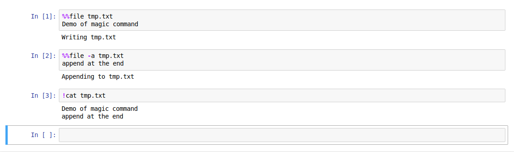
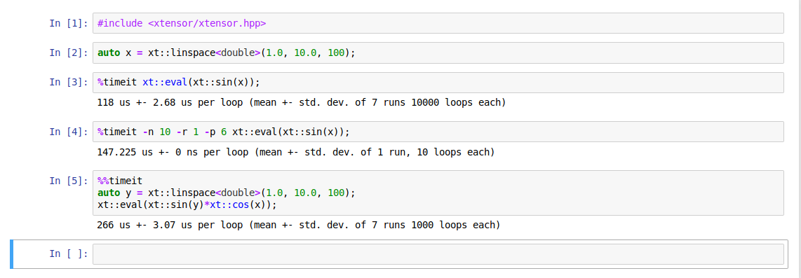

.. Copyright (c) 2017, Johan Mabille, Loic Gouarin and Sylvain Corlay

   Distributed under the terms of the BSD 3-Clause License.

   The full license is in the file LICENSE, distributed with this software.

.. raw:: html

   

Magic commands
==============

Magics are special commands for the kernel that are not part of the C++
programming language.

There are defined with the symbol ``%`` for a line magic and ``%%`` for a cell
magic.

A few magics are available in xeus-cling. In the future, user-defined magics
will also be enabled.

%%executable
------------

Dump the code from all entered cells into an executable binary. The content of
the cell is used for the body of the `main` function.

.. code::

    %%executable filename [-- linker options]

- Example

.. image:: executable.png

- Optional arguments:

Any additional argument is passed to the linker. In particular this can be used
with `-l` to link extra libraries that have otherwise been loaded with

.. code::

    #pragma cling load("...")

Furthermore some options influence code generation:

+-------------------+---------------------------------------------+
| -fsanitize=thread | enable instrumentation with ThreadSanitizer |
+-------------------+---------------------------------------------+
| -g                | enable debug information in the executable  |
+-------------------+---------------------------------------------+

%%file
------

This magic command copies the content of the cell in a file named `filename`.

.. code::

    %%file [-a] filename

- Example

- Optional argument:

+------------+---------------------------------+
| -a         | append the content to the file. |
+------------+---------------------------------+

%timeit
-------

Measure the execution time execution for a line statement (`%timeit`) or for a
block of statements (`%%timeit`)

- Usage in line mode

.. code::

    %timeit [-n<N> -r<R> -p
] statement

- Usage in cell mode

.. code::

    %%timeit [-n<N> -r<R> -p
]
    statements

- Example

- Optional arguments:

+------------+---------------------------------------------------------------------------------------------------------+
| -n         | execute the given statement <N> times in a loop. If this value is not given, a fitting value is chosen. |
+------------+---------------------------------------------------------------------------------------------------------+
| -r         | repeat the loop iteration <R> times and take the best result. Default: 7                                |
+------------+---------------------------------------------------------------------------------------------------------+
| -p         | use a precision of 
 digits to display the timing result. Default: 3                                  |
+------------+---------------------------------------------------------------------------------------------------------+
