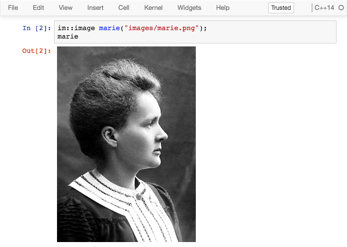
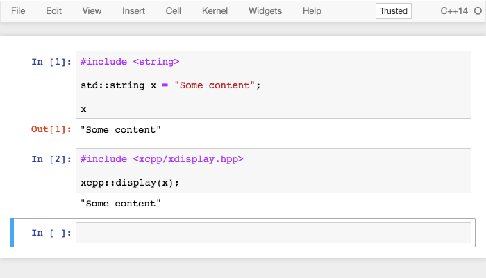

.. Copyright (c) 2017, Johan Mabille, Loic Gouarin and Sylvain Corlay

   Distributed under the terms of the BSD 3-Clause License.

   The full license is in the file LICENSE, distributed with this software.

.. raw:: html

   

Displaying rich content
=======================

The Jupyter rich display system allows displaying rich content in the Jupyter
notebook and other frontend.

This is achieved by sending mime bundles to the front-end containing various
representations of the data that the frontend may use.

A mime bundle may contain multiple alternative representations of the same
object for example

 - a ``text/html`` representation for the notebook and other web frontends.
 - a ``text/plain`` representation for the console.

Besides plain text and html, other mime type can be used such as ``image/png``
or even custom mime type for which a renderer is available in the front-end.

Default plain text representation
---------------------------------

By default, xeus-cling provides a plain text representation for any object.

In the case of a basic type such as ``double`` or ``int``, the value will be
displayed.

For sequences (exposing an iterator pair ``begin`` / ``end``), the content of
the sequence is also displayed.

Finally, for more conplex types, the address of the object is displayed.

Providing custom mime representations for user-defined types
------------------------------------------------------------

For a user-defined class ``myns::foo``, you can easily provide a mime
representation taylored to your needs such as a styled ``html`` table including
the values of various attributes.

This can be achieved by simply overloading the function

.. code::

    nlohmann_json mime_bundle_repr(const foo&);

in the same namespace ``myns`` as ``foo``.

The rich display mechanism of ``xeus-cling`` will pick up this function through
argument-dependent-lookup (ADL) and make use of it upon display.

Example: ``image/png`` representation of an image class
~~~~~~~~~~~~~~~~~~~~~~~~~~~~~~~~~~~~~~~~~~~~~~~~~~~~~~~

In this example, the ``im::image`` class holds a buffer read from a file. The
``mime_bundle_repr`` overload defined in the same namespace simply forwards the
buffer to the frontend.

.. code::

    #include <string>
    #include <fstream>

    #include "xtl/xbase64.hpp"
    #include "nlohmann/json.hpp"

    namespace im
    {
        struct image
        {
            inline image(const std::string& filename)
            {
                std::ifstream fin(filename, std::ios::binary);
                m_buffer << fin.rdbuf();
            }

            std::stringstream m_buffer;
        };

        nlohmann::json mime_bundle_repr(const image& i)
        {
            auto bundle = nlohmann::json::object();
            bundle["image/png"] = xtl::base64encode(i.m_buffer.str());
            return bundle;
        }
    }

Displaying content in the frontend
----------------------------------

The first way to display an object in the front-end is to omit the last
semicolon of a code cell. When doing so, the last expression will be
displayed.

Another way of achieving this, is to include the ``xcpp::display`` function
and passing the object to display. ``xcpp::display`` is defined in the
``<xcpp/xdisplay.hpp>`` header.

.. note::

   A subtle distinction between using ``xcpp::display`` and omitting the last
   semicolon is that the latter results in a cell `output` including a prompt
   number, while the former will only show the rich front-end representation.

   This behavior is consistent to the Python kernel implementation where ``1``
   results in an output while ``print(1)`` result in a display message.
